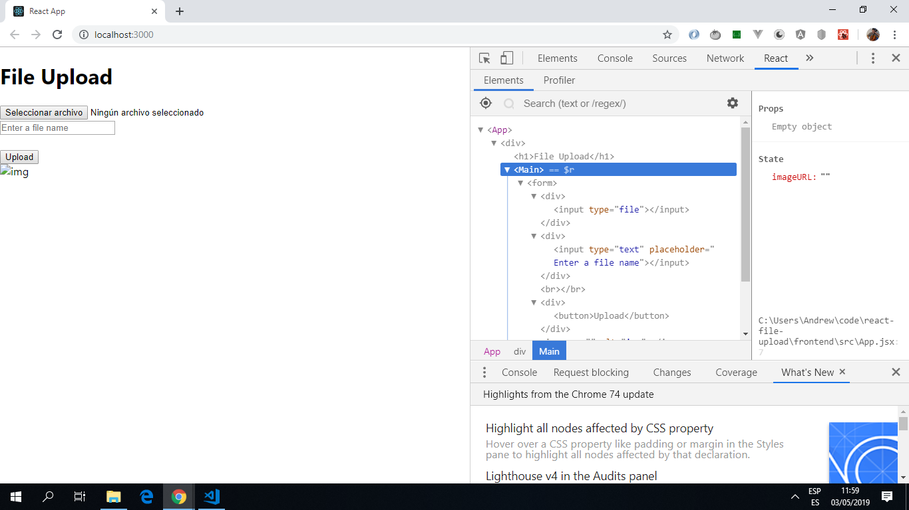

# React File Upload

Express backend server app to handle file uploads.
React frontend.

*** Note: to open web links in a new window use: _ctrl+click on link_**

## Table of contents

* [General info](#general-info)
* [Screenshots](#screenshots)
* [Technologies](#technologies)
* [Setup](#setup)
* [Features](#features)
* [Status](#status)
* [Inspiration](#inspiration)
* [Contact](#contact)

## General info

* Uploads an image file from the React frontend. This file is fetched by the backend using express.js.

* The frontend uses a [FormData object](https://developer.mozilla.org/en-US/docs/Web/API/FormData/FormData) with inputs for the file itself and a file name. The image will be displayed on the frontend.

## Screenshots

.

## Technologies

* [Node.js v10.15.3](https://nodejs.org/) javascript runtime using the [Chrome V8 engine](https://v8.dev/).

* [React v16.8.6](https://reactjs.org/) Frontend javascript library.

## Frontend Setup

### `npm start`

* Runs the app in the development mode. Open [http://localhost:3000](http://localhost:3000) to view in browser.

* The page will reload if you make edits. You will also see any lint errors in the console.

## Backend Setup

* to follow after backend checked

## Code Examples

* extract of Frontend `Main.jsx` that handles the file upload.

```javascript
  // function to upload an image. FormData() constructor used to create a new FormData object.  
  // file will be fetched by the backend server running on port 8000.
  handleUploadImage(event) {
    event.preventDefault();

    const data = new FormData();
    data.append('file', this.uploadInput.files[0]);
    data.append('filename', this.fileName.value);

    fetch('http://localhost:8000/upload', {
      method: 'POST',
      body: data,
    }).then((response) => {
      response.json().then((body) => {
        this.setState({ imageURL: `http://localhost:8000/${body.file}` });
      });
    });
  }

```

## Status & To-Do List

* Status: working front-end.  back-end needs to be checked.

*To do: check backend.

## Inspiration

* [Medium article by Antonio Erdeljac: File upload with Node & React](https://levelup.gitconnected.com/file-upload-with-node-js-react-js-686e342ad7e7)

## Contact

Created by [ABateman](https://www.andrewbateman.org) - feel free to contact me!
